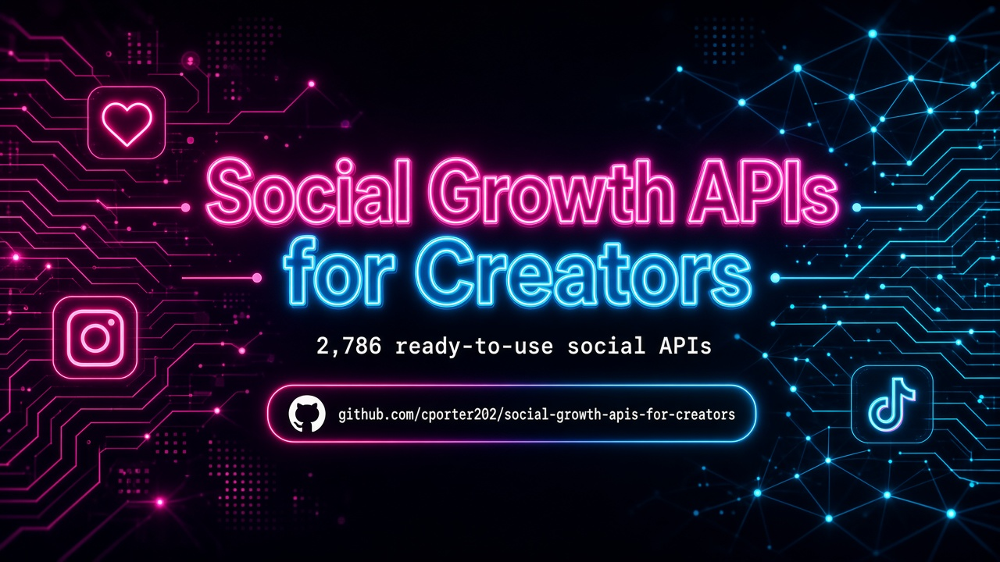

 
 

  <a href="#at-a-glance"><strong>At A Glance</strong></a>
  |
  <a href="#start-here"><strong>Start Here</strong></a>
  |
  <a href="#explore-the-stack"><strong>Explore The Stack</strong></a>
  |
  <a href="#why-this-repo-wins"><strong>Why This Repo Wins</strong></a>
  |
  <a href="#star-history"><strong>Star History</strong></a>

### 🚀 Join My Skool Community

**Want to learn how to vibe code like the pros? Join my Skool community! 🎯**

*I'll show you how to set up applications to use these APIs and start making money! I have the best tech stack when it comes to vibe coding that virtually costs nothing. Forget tools like Loveable, Replit, Manus, Base44, etc.*

 

  <a href="https://www.skool.com/vibe-coding-with-chris-7196" target="_blank" style="display: inline-block; background: #667eea; background-image: linear-gradient(135deg, #667eea 0%, #764ba2 100%); color: #ffffff !important; text-decoration: none !important; padding: 18px 45px; font-size: 18px; font-weight: bold; border-radius: 35px; box-shadow: 0 8px 25px rgba(102, 126, 234, 0.5); letter-spacing: 1px; text-transform: uppercase; border: 2px solid rgba(255, 255, 255, 0.3); cursor: pointer; font-family: -apple-system, BlinkMacSystemFont, 'Segoe UI', Helvetica, Arial, sans-serif;">
    🚀 Join Vibe Coding Community →
  </a>

## At A Glance

> The ultimate collection of social growth APIs — scrape, analyze, and scale across Instagram, TikTok, YouTube, X, and more. **2,786 production-ready APIs** across **6 navigable sections**.

This repository is designed to feel like a launchpad, not a junk drawer. Pick a section folder, scan the API table, and click through to the provider — no endless flat scrolling.

| Metric | Count |
|--------|-------|
| Total APIs | 2,786 |
| Categories | 6 |
| Last Updated | 2026-09-16 |
| Focus | Creator Social Growth |

<table>
  <tr>
    <td width="33%" valign="top">
      <h3>Instagram & TikTok</h3>
      
<strong>848 APIs</strong>

      
Reels, shorts, profiles, hashtags, and engagement for Instagram and TikTok.

      
<a href="./instagram-tiktok/"><strong>Open Instagram & TikTok Directory</strong></a>

    </td>
    <td width="33%" valign="top">
      <h3>YouTube & Video</h3>
      
<strong>356 APIs</strong>

      
YouTube channels, videos, Shorts, transcripts, and video platform data.

      
<a href="./youtube-video/"><strong>Open YouTube & Video Directory</strong></a>

    </td>
    <td width="33%" valign="top">
      <h3>Twitter/X & LinkedIn</h3>
      
<strong>488 APIs</strong>

      
X/Twitter scrapers plus LinkedIn social/content growth tooling.

      
<a href="./twitter-x-linkedin/"><strong>Open Twitter/X & LinkedIn Directory</strong></a>

    </td>
  </tr>
  <tr>
    <td width="33%" valign="top">
      <h3>Facebook & Meta</h3>
      
<strong>233 APIs</strong>

      
Facebook pages, groups, ads library, and Meta ecosystem scrapers.

      
<a href="./facebook-meta/"><strong>Open Facebook & Meta Directory</strong></a>

    </td>
    <td width="33%" valign="top">
      <h3>Analytics & Listening</h3>
      
<strong>418 APIs</strong>

      
Social listening, sentiment, competitor monitoring, and growth analytics.

      
<a href="./analytics-listening/"><strong>Open Analytics & Listening Directory</strong></a>

    </td>
    <td width="33%" valign="top">
      <h3>Other Social Tools</h3>
      
<strong>443 APIs</strong>

      
Cross-platform and niche social tooling that doesn't fit a single network.

      
<a href="./other-social-tools/"><strong>Open Other Social Tools Directory</strong></a>

    </td>
  </tr>
</table>

## Start Here

1. Pick the section you need first from the cards above.
2. Open that folder's README and scan the API names and descriptions.
3. Click through to the provider page for implementation details, pricing, and docs.
4. Build your shortlist fast instead of wasting hours digging through a flat list.

## Explore The Stack

<strong>Instagram & TikTok</strong> (848)

Reels, shorts, profiles, hashtags, and engagement for Instagram and TikTok.

- Instagram profiles / reels
- TikTok videos / sounds
- hashtag discovery
- creator outreach data

[Browse Instagram & TikTok APIs](./instagram-tiktok/)

<strong>YouTube & Video</strong> (356)

YouTube channels, videos, Shorts, transcripts, and video platform data.

- YouTube channels and videos
- Shorts and transcripts
- video metadata
- channel growth intel

[Browse YouTube & Video APIs](./youtube-video/)

<strong>Twitter/X & LinkedIn</strong> (488)

X/Twitter scrapers plus LinkedIn social/content growth tooling.

- Twitter / X posts and profiles
- LinkedIn content growth
- engagement signals
- influencer discovery

[Browse Twitter/X & LinkedIn APIs](./twitter-x-linkedin/)

<strong>Facebook & Meta</strong> (233)

Facebook pages, groups, ads library, and Meta ecosystem scrapers.

- Facebook pages / groups
- Meta ads library
- Messenger / WhatsApp social
- Meta ecosystem data

[Browse Facebook & Meta APIs](./facebook-meta/)

<strong>Analytics & Listening</strong> (418)

Social listening, sentiment, competitor monitoring, and growth analytics.

- social listening
- sentiment / mentions
- competitor monitoring
- growth analytics

[Browse Analytics & Listening APIs](./analytics-listening/)

<strong>Other Social Tools</strong> (443)

Cross-platform and niche social tooling that doesn't fit a single network.

- cross-platform scrapers
- niche networks
- publishing insights
- misc social utilities

[Browse Other Social Tools APIs](./other-social-tools/)

## Built For

<table>
  <tr>
    <td width="25%" align="center"><strong>Creators</strong></td>
    <td width="25%" align="center"><strong>Influencers</strong></td>
    <td width="25%" align="center"><strong>Social Agencies</strong></td>
    <td width="25%" align="center"><strong>Growth Teams</strong></td>
  </tr>
  <tr>
    <td width="25%" align="center"><strong>Brand Managers</strong></td>
    <td width="25%" align="center"><strong>UGC Marketers</strong></td>
    <td width="25%" align="center"><strong>Community Managers</strong></td>
    <td width="25%" align="center"><strong>SaaS Builders</strong></td>
  </tr>
</table>

## Why This Repo Wins

- It is opinionated. Sections map to how builders actually search for APIs.
- It is navigable. Top-level folders beat one giant markdown table every time.
- It is faster to use. Jump straight to the category that matches your use case.
- It keeps affiliate tracking intact (`?fpr=p2hrc6`) on every link.
- Custom SVG hero — no blurry PNG banner.

## Scope Guarantee

This repository intentionally organizes APIs into:

**Instagram & TikTok**, **YouTube & Video**, **Twitter/X & LinkedIn**, **Facebook & Meta**, **Analytics & Listening**, **Other Social Tools**

Unmatched rows land in the `other-*` catch-all so **zero APIs are dropped**.

## Follow the Creator

See [FOLLOW_CREATOR.md](./FOLLOW_CREATOR.md) — follow Chris Porter on Facebook for more valuable repos and updates.

## Star History

## Maintenance Notes

- Section classification is keyword-based on API name + description.
- Every original table row is preserved exactly, including affiliate params.
- Visual launchpad layout matches the style of [agentic-ai-apis](https://github.com/cporter202/agentic-ai-apis).
